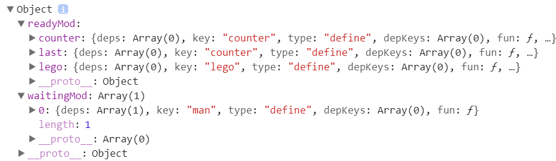
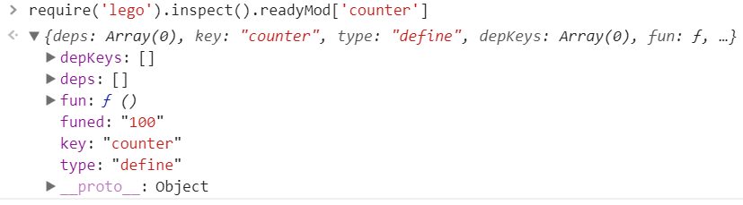

# 调试

代码的中的错误会抛异常，直接可以察觉到，但是如果是模块上线一直没有ready呢？这时模块的factory不会执行，也不会报错，出现这样的问题，不容易发现。这时就需要用到hotloadjs的调试功能了。

``` js
require('lego').inspect()
```
执行这句代码，会把当前模块的所有信息都打印出来。

lego是hotloadjs的内置模块，也就是说，只要引用了hotload.js，就可以访问 lego模块。

比如下面的页面

``` html
<!DOCTYPE html>
<html>
<head>
<meta charset="utf-8">
<title>inspect example</title>
<script src='hotload.js'></script>
</head>
<body>
<script>
    //定义apple
    define('counter', function () {
		console.log('counter run');
        return 100
    });
    //定义 man ，依赖rice,但rice不存在
    define('man',['rice'], function (rice) {
		console.log('man run');
        return 'man'
    });
	console.log(require('lego').inspect());
</script>
</body>
</html>
```
打开页面的console会看到

counter run,但是没有 man run,说明man的factory没有执行。

inspect 输出



分为两个对象。 readyMod包含所有的已经ready的模块，waitingMod包含所有处理waiting状态的模块。

在ready模块中的lego是内置模块。last是最后一个ready的模块。

本例中 counter模块已经ready,man的上线rice不存在，所以man模块处理waiting状态。

在console中输入 

``` js
require('lego').inspect().readyMod['counter']
```
还可以查看模块的具体信息



每个模块有下面的结构,拿counter举例

``` js
{
	depkeys:[],  	//下线
	deps:[],		//上线
	fun:f(),		//factory
	funed:100,  	//factory的执行结果
	key:'counter',  //模块的标识
	type:'define'   //模块类型，只能是dfine或require
}
```

